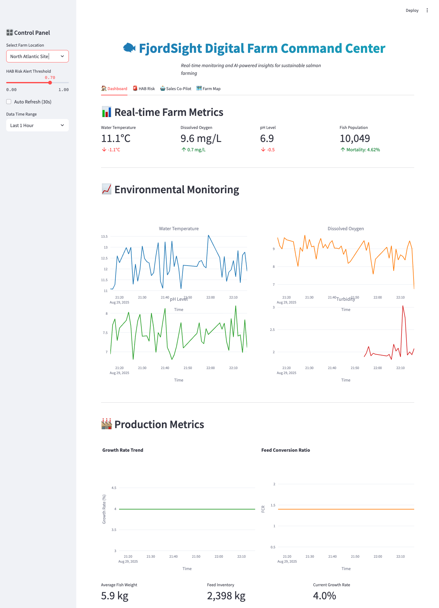

# 🐟 FjordSight PoC: Digital Farm Command Center

Author: Cursor+Marcel Castro

Date: 30.Aug.2025




## Executive Summary

FjordSight's Digital Farm Command Center is a proof of concept that demonstrates how Snowflake can unify complex IT/OT data, deliver predictive insights with AI/ML, and empower all users with secure, governed data access for sustainable salmon farming operations.

This PoC addresses FjordSight's "triple threat" of data silos by creating a centralized command center that provides a holistic, real-time view of operations from egg to harvest, enabling the shift from reactive problem-solving to proactive, AI-driven optimization.


## 🏗️ Architecture Overview

```
┌─────────────────────────────────────────────────────────────────┐
│                    FjordSight Digital Farm                      │
│                      Command Center                             │
└─────────────────────────────────────────────────────────────────┘
                                │
                                ▼
┌─────────────────────────────────────────────────────────────────┐
│                      Consumption Layer                          │
│  ┌─────────────────┐  ┌─────────────────┐  ┌─────────────────┐ │
│  │   Streamlit     │  │    Power BI     │  │   Mobile App    │ │
│  │   Dashboard     │  │   Reports       │  │   Alerts        │ │
│  └─────────────────┘  └─────────────────┘  └─────────────────┘ │
└─────────────────────────────────────────────────────────────────┘
                                │
                                ▼
┌─────────────────────────────────────────────────────────────────┐
│                 Analytics & ML Layer                            │
│  ┌─────────────────┐  ┌─────────────────┐  ┌─────────────────┐ │
│  │  HAB Prediction │  │  Sales Co-Pilot │  │ Cortex Anomaly  │ │
│  │     Model       │  │      ML         │  │   Detection     │ │
│  └─────────────────┘  └─────────────────┘  └─────────────────┘ │
└─────────────────────────────────────────────────────────────────┘
                                │
                                ▼
┌─────────────────────────────────────────────────────────────────┐
│              Storage & Processing Layer                         │
│  ┌─────────────────┐  ┌─────────────────┐  ┌─────────────────┐ │
│  │   Raw Data      │  │  Harmonized     │  │   Analytics     │ │
│  │     Zone        │  │     Zone        │  │     Zone        │ │
│  └─────────────────┘  └─────────────────┘  └─────────────────┘ │
│                    Dynamic Tables & Streams                    │
└─────────────────────────────────────────────────────────────────┘
                                │
                                ▼
┌─────────────────────────────────────────────────────────────────┐
│                    Ingestion Layer                              │
│  ┌─────────────────┐  ┌─────────────────┐  ┌─────────────────┐ │
│  │   Snowpipe      │  │   Kafka         │  │   Marketplace   │ │
│  │   Streaming     │  │   Connector     │  │   Data          │ │
│  └─────────────────┘  └─────────────────┘  └─────────────────┘ │
└─────────────────────────────────────────────────────────────────┘
                                │
                                ▼
┌─────────────────────────────────────────────────────────────────┐
│                      Data Sources                               │
│  ┌─────────────────┐  ┌─────────────────┐  ┌─────────────────┐ │
│  │   MQTT Sensors  │  │   ERP Systems   │  │   External      │ │
│  │   (OT Data)     │  │   (IT Data)     │  │   APIs          │ │
│  └─────────────────┘  └─────────────────┘  └─────────────────┘ │
└─────────────────────────────────────────────────────────────────┘
```

## 🎯 Key Features & Demo Vignettes

### Vignette 1: Unified IT/OT Data Foundation
- **Audience**: Data Engineers, Operations Managers
- **Demonstrates**: Seamless ingestion and unification of siloed IT and OT data
- **Technology**: MQTT → Snowpipe Streaming → Snowflake with Dynamic Tables

### Vignette 2: Proactive Environmental Threat Mitigation
- **Audience**: Data Scientists, Biologists
- **Demonstrates**: HAB (Harmful Algal Bloom) Early Warning System
- **Technology**: Snowpark ML + Cortex AI for predictive modeling

### Vignette 3: AI-Powered Command Center
- **Audience**: Data Analysts, Sales, Executives
- **Demonstrates**: Streamlit dashboard with AI Sales Co-Pilot
- **Technology**: Native Streamlit in Snowflake with ML recommendations

## 🚀 Quick Start

### Prerequisites
- Python 3.8+
- Snowflake account with appropriate permissions
- MQTT broker (optional - simulator included)

### Installation

1. **Clone and Setup**
   ```bash
   git clone <repository-url>
   cd fjordsight
   
   # Option 1: Use uv (recommended - faster)
   uv pip install -r requirements.txt
   
   # Option 2: Use pip (fallback)
   pip install -r requirements.txt
   ```

2. **Configure Environment**
   ```bash
   cp config.py.example config.py
   # Edit config.py with your Snowflake credentials
   ```

3. **Setup Snowflake Database**
   ```bash
   # Run SQL scripts in order:
   # 1. sql/01_setup_database.sql
   # 2. sql/02_create_raw_tables.sql
   # 3. sql/03_create_harmonized_tables.sql
   # 4. sql/04_create_ml_tables.sql
   ```

4. **Start the Demo**
   ```bash
   # Option 1: Full automated demo (recommended)
   python run_demo.py
   
   # Option 2: Simple dashboard only
   python run_streamlit.py
   
   # Option 3: Manual setup (advanced)
   # Terminal 1: Start MQTT sensor simulation
   python src/data_ingestion/mqtt_simulator.py
   
   # Terminal 2: Start data ingestion
   python src/data_ingestion/snowflake_ingestion.py
   
   # Terminal 3: Launch Streamlit dashboard
   streamlit run src/streamlit_app/main.py
   ```

## 🖥️ How to Run the Dashboard

The FjordSight PoC offers multiple ways to run the dashboard depending on your needs:

### Option 1: Full Demo Experience (Recommended)
```bash
python run_demo.py
```
**What it does:**
- Starts MQTT sensor data simulation
- Initializes Snowflake data ingestion (if configured)
- Trains the HAB prediction model
- Launches the Streamlit dashboard
- Provides guided walkthrough instructions

**Best for:** Complete demonstrations and presentations

### Option 2: Dashboard Only (Quick Start)
```bash
python run_streamlit.py
```
**What it does:**
- Launches only the Streamlit dashboard
- Uses synthetic data (works without Snowflake)
- Faster startup for development/testing

**Best for:** Quick testing, development, or when you only need the dashboard

### Option 3: Direct Streamlit
```bash
streamlit run src/streamlit_app/main.py
```
**What it does:**
- Runs Streamlit directly
- Minimal setup, uses synthetic data

**Best for:** Development and debugging

### 🌐 Accessing the Dashboard

Once running, the dashboard is available at:
- **Local URL:** http://localhost:8501
- **Network URL:** http://[your-ip]:8501 (for sharing on local network)

### 📱 Dashboard Features

The dashboard includes four main tabs:

1. **🏠 Dashboard**
   - Real-time farm metrics and KPIs
   - Environmental sensor data visualization
   - Production metrics tracking
   - Interactive charts and gauges

2. **🚨 HAB Risk**
   - Harmful Algal Bloom risk assessment
   - Real-time risk scoring (0-1 scale)
   - Contributing factor analysis
   - Automated recommendations
   - Anomaly detection alerts

3. **🤖 Sales Co-Pilot**
   - AI-powered customer recommendations
   - Production scenario handling
   - Volume optimization suggestions
   - Prioritized customer calling lists

4. **🗺️ Farm Map**
   - Interactive farm location visualization
   - Geographic context for operations
   - Farm selection interface

### ⚙️ Configuration Options

The dashboard supports several configuration options via the sidebar:
- **Farm Location Selection:** Switch between different farm sites
- **HAB Risk Alert Threshold:** Adjust sensitivity (0.0 - 1.0)
- **Auto Refresh:** Enable/disable automatic data updates
- **Time Range:** Select data viewing period (1 hour to 7 days)

### 🔄 Data Sources

The dashboard intelligently handles data from multiple sources:
- **Snowflake Connection:** Real data when configured
- **Synthetic Data:** Realistic simulated data as fallback
- **MQTT Simulation:** Live sensor data simulation
- **External APIs:** Weather and oceanographic data

## 📊 Dashboard Features

### Real-time Farm Monitoring
- Live sensor data visualization
- Environmental condition tracking
- Production metrics dashboard
- Interactive farm location map

### HAB Risk Assessment
- Real-time risk scoring (0-1 scale)
- Risk level classification (LOW/MEDIUM/HIGH)
- Contributing factor analysis
- Automated recommendations
- Anomaly detection alerts

### AI Sales Co-Pilot
- Scenario-based sales recommendations
- Customer profitability ranking
- Volume optimization suggestions
- Call prioritization with reasons

## 🔧 Technical Implementation

### Data Ingestion
- **MQTT Simulator**: `SensorDataSimulator` class (`src/data_ingestion/mqtt_simulator.py:17`)
  - Sensor ranges: Realistic values for salmon farming (lines 24-31)
  - Data generation: `generate_sensor_reading()` method (lines 59-103)
  - Publishing: 30-second intervals to 7 sensor topics (lines 105-118)
- **Snowflake Ingestion**: `MQTTToSnowflakeIngestion` class (`src/data_ingestion/snowflake_ingestion.py:78`)
  - JWT Authentication: Base64-encoded DER format (lines 46-55)
  - Batch processing: 100 messages per batch for efficiency (line 97)
  - MQTT callbacks: `on_mqtt_message()` for real-time processing (lines 198-209)
- **Dynamic Tables**: Automated IT/OT harmonization (`sql/03_create_harmonized_tables.sql:77`)
  - Target lag: 1 minute for near real-time updates (line 78)
  - Sensor pivoting: Transform MQTT time-series to columnar format (lines 86-92)
  - ERP integration: Latest production metrics via subqueries (lines 94-99)

### Machine Learning Models

#### HAB Prediction Model
- **Algorithm**: Random Forest Regression (`src/models/hab_prediction_model.py:275`)
- **Feature Engineering**: `create_training_features()` method (lines 102-157)
  - Moving averages: 3-hour and 6-hour windows (lines 121-124)
  - Rate of change features (lines 126-129) 
  - Interaction features: temp×pH, oxygen/turbidity ratio (lines 131-135)
  - Risk indicator flags (lines 137-141)
- **Domain Knowledge Rules**: `simple_rule_based_prediction_with_data()` (lines 471-555)
  - Temperature risk: >15°C adds 0.3 to risk score (lines 486-490)
  - pH risk: >8.0 adds 0.2 to risk score (lines 493-498)
  - Oxygen risk: <7.0 mg/L adds 0.2 to risk score (lines 500-505)
  - Turbidity risk: >3.0 NTU adds 0.15 to risk score (lines 507-510)
  - Current speed risk: <0.3 m/s adds 0.15 to risk score (lines 512-515)
- **Output**: Risk score (0-1) and risk level classification (lines 523-529)
- **Data Source**: Real-time from `HARMONIZED_FARM_DATA_DT` Dynamic Table (lines 299-318)

#### Sales Co-Pilot Algorithm
- **Core Algorithm**: `calculate_customer_score()` method (`src/streamlit_app/sales_copilot.py:44`)
- **Scoring Factors** (lines 48-49):
  - Profitability tier (30%): `profitability_map` scoring (lines 52-53)
  - Relationship score (25%): Normalized 0-5 scale (lines 55-56)
  - Volume match (20%): Order size optimization (lines 58-70)
  - Product preference (15%): Product matching logic (lines 72-81)
  - Purchase timing (10%): Frequency-based scoring (lines 83-94)
- **Volume Calculation**: `calculate_recommended_volume()` (lines 103-130)
- **Revenue Estimation**: `calculate_expected_revenue()` (lines 132-155)
- **Recommendation Generation**: `generate_recommendations()` (lines 179-238)
- **Output**: Ranked customer list with probability scores and reasoning

### Data Architecture

#### Raw Data Zone
- **`RAW_SENSOR_DATA`**: MQTT sensor readings (`sql/02_create_raw_tables.sql:8-21`)
  - Real-time ingestion: `MQTTToSnowflakeIngestion` class (`src/data_ingestion/snowflake_ingestion.py:78`)
  - Batch processing: 100 records per batch (`snowflake_ingestion.py:97`)
- **`RAW_ERP_DATA`**: Production and inventory data (`sql/02_create_raw_tables.sql:24-35`)
  - ERP simulation: `ERPDataSimulator` class (`src/data_ingestion/erp_data_simulator.py:47`)
  - Feed inventory updates: every 5 minutes (`erp_data_simulator.py:54`)
  - Production metrics: every 10 minutes (`erp_data_simulator.py:55`)

#### Harmonized Data Zone
- **`HARMONIZED_FARM_DATA_DT`**: Dynamic Table for IT/OT unification (`sql/03_create_harmonized_tables.sql:77`)
  - Target lag: 1 minute for near real-time processing (line 78)
  - Sensor data pivoting: `CASE WHEN` statements (lines 86-92)
  - ERP data integration: Subqueries for latest values (lines 94-99)
  - Automated refresh: Snowflake manages updates automatically

#### Analytics Zone
- **HAB Risk Processing**: `predict_hab_risk()` method (`src/models/hab_prediction_model.py:292`)
- **Sales Recommendations**: `generate_recommendations()` (`src/streamlit_app/sales_copilot.py:179`)
- **Dashboard Integration**: `load_farm_data()` (`src/streamlit_app/data_loader.py:85`)

### Streamlit Dashboard Implementation

#### Main Application (`src/streamlit_app/main.py`)
- **App Class**: `FjordSightApp` (line 79)
- **Data Loading**: Dynamic Table queries for real-time data (lines 90-119)
- **HAB Risk Panel**: `render_hab_risk_panel()` method (lines 198-267)
  - Risk gauge visualization: Plotly indicator chart (lines 213-235)
  - Alert system: Threshold-based warnings (lines 263-264)
- **Sales Co-Pilot Interface**: `render_sales_copilot()` (lines 269-336)
  - Scenario input: Volume mismatch handling (lines 274-287)
  - AI recommendations: Customer scoring and ranking (lines 293-335)

#### Data Processing (`src/streamlit_app/data_loader.py`)
- **Snowflake Connection**: JWT authentication (lines 26-70)
- **Dynamic Table Queries**: Real-time harmonized data (lines 90-119)
- **Synthetic Data Fallback**: `generate_synthetic_data()` (lines 127-220)
- **Customer Data Management**: `load_customer_data()` (lines 287-320)

### Configuration Management (`config.py`)
- **Snowflake Settings**: JWT authentication parameters (lines 15-24)
- **MQTT Configuration**: Broker and topic settings (lines 27-29)
- **Farm Locations**: Geographic coordinates for 3 sites (lines 35-38)
- **Model Parameters**: HAB thresholds and prediction horizons (lines 41-44)

## 📈 Success Criteria & KPIs

| Success Criterion | Measurement Method | Business Impact KPI |
|-------------------|-------------------|-------------------|
| MQTT data ingestion < 1-minute latency | Timestamp comparison | Reduced Data Pipeline Maintenance Costs |
| HAB model deployment with >80% accuracy | Model validation metrics | Reduced Risk of Fish Mortality Events |
| Functional Streamlit app with AI Co-Pilot | User acceptance testing | Increased Revenue from Operational Yield Optimization |
| Real-time dashboard performance | Response time monitoring | Improved Decision Making Speed |

## 🔍 Demo Scenarios

### Scenario 1: High HAB Risk Alert
1. Navigate to "HAB Risk" tab
2. Observe risk score > 0.7 triggering alert
3. Review contributing factors and recommendations
4. Demonstrate proactive response capabilities

### Scenario 2: Production Volume Mismatch
1. Go to "Sales Co-Pilot" tab
2. Enter predicted vs actual volume scenario
3. Generate AI-powered customer recommendations
4. Show prioritized calling list with reasoning

### Scenario 3: Real-time Monitoring
1. View "Dashboard" tab for live metrics
2. Observe sensor data updates
3. Monitor production KPIs
4. Interact with farm location map

## 🛠️ Development & Customization

### Adding New Sensors
1. Update `mqtt_simulator.py` with new sensor types
2. Modify database schema in SQL files
3. Update harmonization logic in Dynamic Tables
4. Add visualizations to Streamlit dashboard

### Extending ML Models
1. Create new model in `src/models/`
2. Add training data preparation
3. Implement prediction endpoints
4. Integrate with dashboard

### Custom Dashboards
1. Modify `src/streamlit_app/main.py`
2. Add new visualization components
3. Implement data loading functions
4. Update navigation and layout

## 🛠️ Quick MQTT Commands Reference

### Monitor Live Data Flow
```bash
# Watch all sensor data in real-time:
mosquitto_sub -h localhost -p 1883 -t "sensors/#" -v

# Monitor specific sensors:
mosquitto_sub -h localhost -p 1883 -t "sensors/turbidity" -v
mosquitto_sub -h localhost -p 1883 -t "sensors/water_temp" -v
mosquitto_sub -h localhost -p 1883 -t "sensors/oxygen" -v
mosquitto_sub -h localhost -p 1883 -t "sensors/ph" -v
```

### Test MQTT Functionality
```bash
# Publish test messages:
mosquitto_pub -h localhost -p 1883 -t "sensors/turbidity" -m '{"value": 2.1, "unit": "NTU"}'
mosquitto_pub -h localhost -p 1883 -t "sensors/water_temp" -m '{"value": 12.5, "unit": "celsius"}'

# Run comprehensive MQTT test:
python test_mqtt.py

# Test complete MQTT → Snowflake flow:
python test_mqtt_to_snowflake.py
```

### MQTT Broker Management
```bash
# Start/stop broker:
brew services start mosquitto
brew services stop mosquitto
brew services restart mosquitto

# Check if broker is running:
lsof -i :1883
netstat -an | grep 1883
```

## 📚 Additional Resources

### Documentation
- [Snowflake Documentation](https://docs.snowflake.com/)
- [Streamlit Documentation](https://docs.streamlit.io/)
- [Snowpark ML Guide](https://docs.snowflake.com/en/developer-guide/snowpark-ml/index)
- [Mosquitto MQTT Broker](https://mosquitto.org/documentation/)

### Training Materials
- `notebooks/`: Jupyter notebooks for model development
- `docs/PRD.md`: Complete Product Requirements Document
- SQL scripts with inline documentation

## 🤝 Support & Contribution

### Getting Help
- Check the troubleshooting section below
- Review log files for error messages
- Contact the development team

### Contributing
1. Fork the repository
2. Create feature branch
3. Submit pull request with documentation

## 🔧 Troubleshooting

### Common Issues

#### Snowflake Connection Errors
```bash
# Check credentials in config.py
# Verify network connectivity
# Ensure warehouse is running
```

#### Network Policy Issues (IP Restrictions)
If you get "Network policy is required" errors, you need to configure IP access:

```sql
-- Connect as ACCOUNTADMIN and configure network policy
USE ROLE ACCOUNTADMIN;

-- Get your current IP address first:
-- Run: curl -s https://ipinfo.io/ip

-- Remove existing network policy from user (if any)
ALTER USER mlops_user UNSET NETWORK_POLICY;
DROP NETWORK POLICY IF EXISTS ALLOW_DEMO;

-- Create network policy with your IP addresses
CREATE NETWORK POLICY ALLOW_DEMO
  ALLOWED_IP_LIST = ('92.220.67.138','57.133.204.194')  -- Replace with your IPs
  COMMENT = 'Allow access for FjordSight PoC demo';

-- Assign the policy to the user (NOT to the full account for security)
ALTER USER mlops_user SET NETWORK_POLICY = ALLOW_DEMO;

-- Confirm it's set correctly
DESC USER mlops_user;

-- Test connection
SELECT CURRENT_USER(), CURRENT_ROLE(), CURRENT_IP();
```

**Important Notes:**
- Replace IP addresses with your actual IPs
- Use `curl -s https://ipinfo.io/ip` to get your current IP
- Apply policy to specific users, not the entire account
- Remove the policy after demo for security: `ALTER USER mlops_user UNSET NETWORK_POLICY;`

#### MQTT Broker Issues
```bash
# Install local MQTT broker:
brew install mosquitto  # macOS
sudo apt-get install mosquitto  # Ubuntu

# Start MQTT broker:
brew services start mosquitto  # macOS
sudo systemctl start mosquitto  # Linux

# Check broker status:
brew services list | grep mosquitto  # macOS
sudo systemctl status mosquitto  # Linux
```

#### MQTT Data Flow Troubleshooting
```bash
# 1. Listen to all sensor topics to verify data flow:
mosquitto_sub -h localhost -p 1883 -t "sensors/#" -v

# 2. Listen to specific sensor types:
mosquitto_sub -h localhost -p 1883 -t "sensors/turbidity" -v
mosquitto_sub -h localhost -p 1883 -t "sensors/water_temp" -v
mosquitto_sub -h localhost -p 1883 -t "sensors/oxygen" -v

# 3. Publish test messages to verify broker works:
mosquitto_pub -h localhost -p 1883 -t "sensors/water_temp" -m '{"value": 12.5, "unit": "celsius"}'
mosquitto_pub -h localhost -p 1883 -t "sensors/turbidity" -m '{"value": 2.1, "unit": "NTU"}'

# 4. Check if MQTT simulator is publishing data:
python test_mqtt.py

# 5. Test MQTT to Snowflake data flow:
python test_mqtt_to_snowflake.py

# 6. Monitor MQTT broker logs (if needed):
tail -f /opt/homebrew/var/log/mosquitto/mosquitto.log  # macOS
sudo journalctl -u mosquitto -f  # Linux
```

#### Missing Sensor Data in Dashboard
```bash
# Check what sensor types are being captured:
python -c "
import snowflake.connector
from config import Config
# ... connection code ...
cursor.execute('SELECT DISTINCT SENSOR_TYPE, COUNT(*) FROM RAW_SENSOR_DATA GROUP BY SENSOR_TYPE')
print('Available sensors:', cursor.fetchall())
"

# Verify MQTT topics configuration:
python -c "from config import Config; print('MQTT Topics:', Config().MQTT_TOPICS)"

# Restart data ingestion with updated topics:
pkill -f snowflake_ingestion.py
python src/data_ingestion/snowflake_ingestion.py
```

#### Dashboard Not Loading
```bash
# Check Python dependencies (use uv for faster installation)
uv pip install -r requirements.txt
# or fallback to: pip install -r requirements.txt

# Verify Streamlit installation
streamlit --version
```

#### Package Installation Issues
```bash
# Install uv for faster package management (recommended)
curl -LsSf https://astral.sh/uv/install.sh | sh
# or: pip install uv

# Then install dependencies
uv pip install -r requirements.txt
```

#### Model Training Failures
```bash
# Ensure sufficient data in Snowflake
# Check model dependencies
# Review log files for specific errors
```

#### Verifying Complete Data Pipeline
```bash
# 1. Check MQTT broker status:
brew services list | grep mosquitto

# 2. Verify MQTT data flow:
mosquitto_sub -h localhost -p 1883 -t "sensors/#" -v

# 3. Check Snowflake data ingestion:
python test_mqtt_to_snowflake.py

# 4. Verify Dynamic Table is updating:
python -c "
from config import Config
import snowflake.connector
# Connect to Snowflake and check:
# SELECT COUNT(*) FROM HARMONIZED_FARM_DATA_DT WHERE TIMESTAMP >= DATEADD('hour', -1, CURRENT_TIMESTAMP());
"

# 5. Test complete data flow:
python -c "
import sys
sys.path.append('src')
from streamlit_app.data_loader import DataLoader
loader = DataLoader()
data = loader.load_farm_data('North Atlantic Site', 2)
print(f'Dashboard data: {len(data)} records')
print('Available columns:', list(data.columns))
"
```

#### Data Not Showing in Dashboard
```bash
# Check if Streamlit is loading real data:
python -c "
import sys
sys.path.append('src')
from streamlit_app.data_loader import DataLoader
loader = DataLoader()
data = loader.load_farm_data('North Atlantic Site', 1)
print(f'Records loaded: {len(data)}')
if len(data) > 0:
    latest = data.iloc[0]
    print(f'Latest data: Temp={latest.get(\"WATER_TEMP_C\", \"N/A\")}°C, Turbidity={latest.get(\"TURBIDITY_NTU\", \"N/A\")} NTU')
"

# Restart Streamlit to refresh data connections:
pkill -f streamlit
python run_streamlit.py
```

## 📋 Project Structure

```
fjordsight/
├── README.md                          # This file
├── requirements.txt                   # Python dependencies
├── config.py                         # Configuration settings
├── docs/                             # Documentation
│   ├── PRD.md                        # Product Requirements Document
│   └── mybetterprompthelper.md       # Additional docs
├── sql/                              # Database setup scripts
│   ├── 01_setup_database.sql         # Database and schema creation
│   ├── 02_create_raw_tables.sql      # Raw data tables
│   ├── 03_create_harmonized_tables.sql # Data harmonization
│   └── 04_create_ml_tables.sql       # ML and analytics tables
├── src/                              # Source code
│   ├── data_ingestion/               # Data ingestion components
│   │   ├── mqtt_simulator.py         # MQTT sensor simulation
│   │   └── snowflake_ingestion.py    # Snowflake data loading
│   ├── models/                       # ML models
│   │   └── hab_prediction_model.py   # HAB prediction model
│   └── streamlit_app/                # Dashboard application
│       ├── main.py                   # Main Streamlit app
│       ├── data_loader.py            # Data loading utilities
│       └── sales_copilot.py          # AI Sales Co-Pilot
└── notebooks/                        # Jupyter notebooks (optional)
```

## 🎉 Conclusion

This FjordSight PoC demonstrates Snowflake's unique capability to serve as the unified platform for modern aquaculture operations. By combining real-time data ingestion, advanced analytics, and AI-powered insights, organizations can transform from reactive problem-solving to proactive optimization.

The proof of concept showcases:
- **Technical Excellence**: Near real-time data processing with < 1-minute latency
- **Business Value**: AI-driven insights that directly impact profitability
- **User Experience**: Intuitive dashboards accessible to all stakeholders
- **Scalability**: Architecture that grows with business needs

Ready to revolutionize your aquaculture operations? Start with this PoC and scale to production! 🚀
